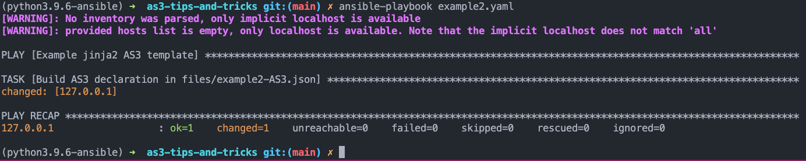
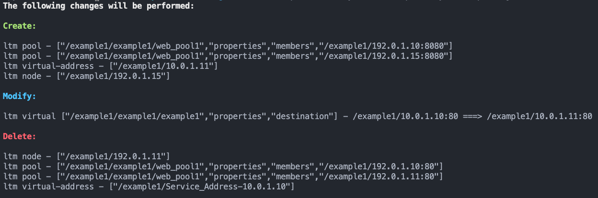

# AS3 Tips and Tricks! 

1.  [Increase Memory and Timeouts](#1)  
2.  [Use a Templating Engine](#2)  
3.  [Multi-Team: Refer to something outside AS3](#3)  
4.  [Multi-Team: Shared AS3 Workflow](#4)  
5.  [Always Dry Run in Prod](#5)  


## #1 Increase memory and timeouts to improve Big-IP REST <a name="1"></a>
Per [AS3 Best Practices guide](https://clouddocs.f5.com/products/extensions/f5-appsvcs-extension/latest/userguide/best-practices.html#increase-timeout-values-if-the-rest-api-is-timing-out)   

Increase internal timeouts from 60 to 600 seconds:
```
tmsh modify sys db icrd.timeout value 600
tmsh modify sys db restjavad.timeout value 600
tmsh modify sys db restnoded.timeout value 600
```

Increase RESTJAVAD memory (skip if experiencing memory pressure):
```
tmsh modify sys db provision.extramb value 2048
tmsh modify sys db provision.tomcat.extramb value 20
```
One of the following:    
Before TMOS 15.1.8:   
```
tmsh modify sys db icrd.timeout restjavad.useextramb value true
```   
OR  
After TMOS 15.1.9:  
```
tmsh modify sys db icrd.timeout provision.restjavad.extramb value 600
```  

save configuration:
```
tmsh save sys config
```
verify everything looks good:
```
tmsh list sys db icrd.timeout
tmsh list sys db restjavad.timeout  
tmsh list sys db restnoded.timeout 
tmsh list sys db provision.extramb
tmsh list sys db provision.tomcat.extramb
tmsh list sys db provision.restjavad.extramb
```

then restart services:
```
tmsh restart sys service restjavad
tmsh restart sys service restnoded
```

___

## #2 Use a Templating Engine <a name="2"></a>
Two common templating engines for AS3 schema is [FAST](https://clouddocs.f5.com/products/extensions/f5-appsvcs-templates/latest/) and [jinja2](https://docs.ansible.com/ansible/latest/playbook_guide/playbooks_templating.html)

To see how these templating engines can help, lets take a look at the AS3 schema [getting started simple HTTP server](https://clouddocs.f5.com/products/extensions/f5-appsvcs-extension/latest/declarations/getting-started.html#simple-http-application) in YAML  
* Omitted first 9 lines for brevity  

```yaml
    Sample_01:
        class: Tenant

        A1:
            class: Application

            service:
                class: Service_HTTP
                virtualAddresses:
                    - 10.0.1.10
                pool: web_pool

            web_pool:
                class: Pool
                monitors:
                    - http
                members:
                    -
                        servicePort: 80
                        serverAddresses:
                            - 192.0.1.10
                            - 192.0.1.11
```
This AS3 schema in 18 lines declares:
- One Tenant `Sample_01`
    - One Application `A1` 
        - One HTTP virtual server named `service`
            - IP 10.0.1.10
            - default pool `web_pool`    
        - One pool named `web_pool`
            - with members
                -   192.0.1.10:80
                -   192.0.1.11:80

What if we need to add two more virtual servers and two more pools?

Instead of copy/paste those 18 lines of YAML and making modifications, we can generate the AS3 schema using a jina2 template!  

Our inputs to the template will be the three virtual servers:
```YAML
    VIRTUALS:
      - name: "example1"
        virtualAddresses: "10.0.1.10"
        default_pool: "web_pool1"
      - name: "example2"
        virtualAddresses: "10.0.1.11"
        default_pool: "web_pool2"
      - name: "example3"
        virtualAddresses: "10.0.1.12"
        default_pool: "web_pool3"
```
and the three pools:
```yaml
    POOLS:
      - name: "web_pool1"
        servicePort: 80
        serverAddresses: 
          - "192.0.1.10"
          - "192.0.1.11"
      - name: "web_pool2"
        servicePort: 80
        serverAddresses: 
          - "192.0.2.10"
          - "192.0.2.11"
      - name: "web_pool3"
        servicePort: 80
        serverAddresses: 
          - "192.0.3.10"
          - "192.0.3.11"
```
The jinja2 template is located in `templates/example2.j2`

> Hands on activity:
> 1. git clone this repo to a system with ansible installed  
> `git clone git@github.com:megamattzilla/as3-tips-and-tricks.git`  
> 
> 2. Build the AS3 schema by running the template via ansible:  
> `ansible-playbook example2.yaml`
> 
> 3. profit
>
> Expected Output:
> 
>
> The created AS3 schema is in `files/example2-AS3.json`

___

## #3 Multi-Team: Refer to something outside AS3 <a name="3"></a>

In example #2, we created virtual servers and pools in AS3 schema. 

Sometimes, its helpful to have a virtual server created in AS3 reference a profile or policy that is created outside of AS3. 

You have two teams co-managing a device using AS3. 
- Team1 authors AS3 schema to create LTM objects
- Team2 manages an AWAF policy in Big-IP UI    

> Team1 could create the AWAF policy in AS3, however Team2 would be unable to use the Big-IP UI to make policy changes.  

Team1 could simply refer to the AWAF policy created by Team2 using the `bigip` pointer: 
```yaml
            service:
                class: Service_HTTP
                virtualAddresses:
                    - 10.0.1.10
                pool: web_pool
                policyWAF:
                    bigip: /Common/Team2_AWAF_Policy
```
Any changes Team2 makes to the AWAF policy `Team2_AWAF_Policy` will occur directly and without any change in AS3. 

___

## #4 Multi-Team: linked AS3 Workflow <a name="4"></a>

You have two teams co-managing a device using AS3. 
- Team1 can author a complicated AS3 post with entire AS3 schema
- Team2 needs to modify a small subset of AS3 schema. Team2 cannot author a full AS3 post.   

Team1 and Team2 can use a linked workflow that will always independently generate the same AS3 desired state.  
One way to do this is have both teams refer to a shared source-of-truth, such as a variable file stored in git.  

In this example, a shared variable file `example4.shared-vars.yml` contains:
```yaml
WAF_POLICIES:
  - name: "asm.appA"
    tenant: "example1"
    url: "https://raw.githubusercontent.com/megamattzilla/f5PublicConfigCommon/1.0.4/wafPolicies/asm.appA.xml"
``` 

When Team1 issues an AS3 post, the above AWAF policy will be created via URL reference. 

If Team2 needs to make a change to the WAF policy, they will modify the shared variable to point to a new URL such as version `1.0.5`

The next time Team1 performs an AS3 POST, the shared variable file will introduce the AWAF version change to `1.0.5`

If Team2 wants to push out the change immediately, without involving Team1, they can issue an AS3 PATCH with this change. 

Example PATCH:  
`PATCH https://{{host}}:{{mgmt_port}}/mgmt/shared/appsvcs/declare`
```json
[
    {
        "op": "replace",
        "path": "/example1/example1/asm.appA/url",
        "value": "https://raw.githubusercontent.com/megamattzilla/f5PublicConfigCommon/1.0.5/wafPolicies/asm.appA.xml"
     }
]
```
*Note: AS3 will run the `replace` function against the latest AS3 declaration, and then re-run the entire AS3 declaration. 

### You may be thinking, could we do this same linked workflow with AS3 POST combined with a non-AS3 imperative change? 

Sometimes, yes.  

I have tested some AS3 classes such as `Data_Group` and found that rather than AS3 PATCH you can perform an outside-of-AS3 imperative change with REST API or ansible module.   

The next AS3 POST will pickup the change you made outside of AS3, notice that it matches desired state (shared variable updated AS3 desired state), and report no changes needed. 

Not all AS3 classes have the ability to due this. See [AS3 issue #580](https://github.com/F5Networks/f5-appsvcs-extension/issues/850).

> Hands on activity:
> 1. git clone this repo to a system with ansible installed  
> `git clone git@github.com:megamattzilla/as3-tips-and-tricks.git`  
> 
> 2. Build the Team1 AS3 schema by running the template via ansible:  
> `ansible-playbook example4-Team1.yaml`
> 
> 3. Take the contents of `files/example4-AS3-Team1.json` and POST to AS3 of a Big-IP
>
> 4. Make the change to the shared variable file `example4.shared-vars.yml`  
> Change line 4 from: `url: "https://.../1.0.4/..."`  
> to: `url: "https://.../1.0.5/..."`
>
> 5. Build the Team2 AS3 schema by running the template via ansible:  
> `ansible-playbook example4-Team2.yaml`
>
> 6. Take the contents of `files/example4-AS3-Team2.json` and PATCH to AS3 of a Big-IP
>
> 7. Re-run the Team1 AS3 schema by running the template via ansible:  
> `ansible-playbook example4-Team1.yaml`
>
> 8. Notice the `files/example4-AS3-Team1.json` has the updated `1.0.5` version.  
> There are no effective changes in this schema. 


___

## #5 Always Dry Run in Prod <a name="5"></a>

AS3 has a dry run feature that will process an AS3 declaration, without making a change, and report back a pass/fail. 

That is controlled by this AS3 schema:
```json
      "controls": {
            "class": "Controls",
            "dryRun": true
      },
```

Which will provide this example (pass) output when AS3 is submitted:
```json
       {
            "code": 200,
            "message": "success",
            "dryRun": true,
            "lineCount": 20,
            "host": "localhost",
            "tenant": "example1",
            "runTime": 1469,
        }
```

This by itself is very useful and a good idea to automate adding before applying an AS3 declaration in production.

  
### But Wait, There's More! 

There is an additional [trace feature](https://clouddocs.f5.com/products/extensions/f5-appsvcs-extension/latest/declarations/miscellaneous.html#using-traceresponse-to-enable-traces-in-as3-responses) that can be added to the AS3 schema 

Example using `traceResponse`:
```json
      "controls": {
            "class": "Controls",
            "traceResponse": true,
            "dryRun": true
      },
```

This causes AS3 to report back detailed changes in addition to pass/fail.

The output for the traceResponse appears as new json keys in the AS3 response `traces`:
```json
    "traces": {
        "tenant-Desired": {
        {...}    
        },
        "tenant-Current": {
          {...}
        },
        "tenant-Diff": [
            {...} 
        ]
    }
```
The diff output is generated using the npm [deep diff package](https://www.npmjs.com/package/deep-diff?activeTab=readme) and looks like this:
```json
            {
                "kind": "E",
                "path": [
                    "/Common/Shared/demo-https",
                    "properties",
                    "destination"
                ],
                "lhs": "/Common/Shared/192.168.1.100:9999",
                "rhs": "/Common/Shared/192.168.1.100:9998",
                "tags": [
                    "tmsh"
                ],
                "command": "ltm virtual",
                "lhsCommand": "ltm virtual",
                "rhsCommand": "ltm virtual"
            },
```
Can you tell what AS3 is going to change?? 

Deep diff has an explanation of its syntax: 
``` 
- kind - indicates the kind of change; will be one of the following:
    - N - indicates a newly added property/element
    - D - indicates a property/element was deleted
    - E - indicates a property/element was edited
    - A - indicates a change occurred within an array

- path - the property path (from the left-hand-side root)

- lhs - the value on the left-hand-side of the comparison (undefined if kind === 'N')
- rhs - the value on the right-hand-side of the comparison (undefined if kind === 'D')
```

The output indicates the `LTM virtual` /Common/Shared/demo-https property `destination` is going to change from `9999` -> `9998`. 


What to do with this dryrun + traceresponse output:
- leave as JSON and apply simple rules 
    - looking for kind D (delete) and notify an administrator if an unusual amount of deletions would occur. 
    - The kind D (delete) output will identify some <u>out of band</u> AS3 changes that AS3 will delete. 
- parse the JSON to provide a more human friendly output! 

Example of terraform-esque output:



> Hands on activity:
> 1. git clone this repo to a system with ansible installed  
> `git clone git@github.com:megamattzilla/as3-tips-and-tricks.git`  
> 
> 2. Build the baseline AS3 schema (before dry run) by running the example2 template via ansible:  
> `ansible-playbook example2.yaml`
> 
> 3. Take the contents of files/example2-AS3.json and POST to AS3 of a Big-IP. Now we have a baseline to perform a dry run. 
>
> 4. Build the dry run AS3 schema by running the example5 template via ansible:  
> `ansible-playbook example5.yaml`  
>
> *Notice that we reused the jinja2 template from earlier and setting a dryrun variable to have jinja2 add that schema for us. 
>
> 5. Take the contents of files/example5-AS3.json and POST to AS3 of a Big-IP to perform the dry run.  
>
> 6. Example output is located in `example5-dryrun-response.json` that should match your output from Big-IP.
>
> 7. Parse AS3 dry run output to be human readable:
> 
> `./parse_as3_dryrun.sh example5-dryrun-response.json`
